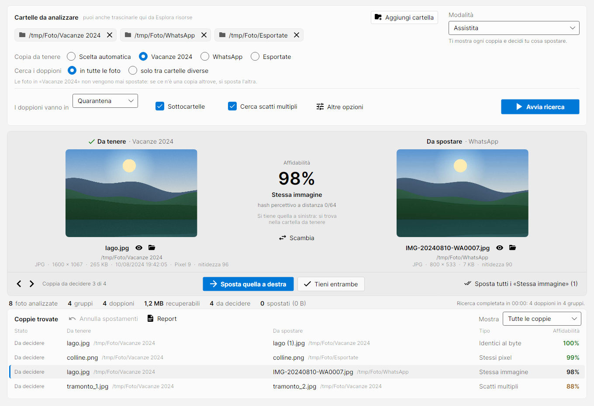

<p align="center">
  
</p>

<h1 align="center">DupliFoto</h1>

<p align="center">
  Find and clean up duplicate photos on Windows: exact copies, recompressed or resized versions, and burst shots.<br>
  Portable, safe by design, and able to use your NPU or GPU.
</p>

<p align="center">
  <a href="https://github.com/St3f4n1n0/DupliFoto/releases/latest"></a>
  <a href="https://github.com/St3f4n1n0/DupliFoto/actions/workflows/build.yml"></a>
  <a href="LICENSE"></a>
</p>



## Features

- **Finds every kind of duplicate:**
  - byte-identical files, even when renamed;
  - the same pixels with different metadata;
  - the same picture recompressed, resized or rotated (for example, a copy that went through WhatsApp);
  - several shots of the same scene taken seconds apart.
- **Side-by-side comparison.** The copy to keep is on the left and the one to move on the right, with a confidence score and the reason. You can move the right-hand copy, keep both, or swap which one to keep.
- **You choose which folder wins.** Pick the folder whose copies must always stay (for example, the one you have already catalogued), and compare folders only against each other if you like: "what in *Downloads* is already in *Photos*?".
- **Never deletes anything.** Duplicates go to a quarantine folder that can be restored with one click, or to the Recycle Bin.
- **Portable.** A single `.exe` with nothing to install: .NET and every library are included.
- **Many formats:** JPEG, PNG, HEIC, AVIF, WebP, TIFF, JPEG XL and the common RAW formats.
- **Optional neural model** (DINOv2) that runs on the NPU, the GPU or the CPU through Windows ML.
- **Command-line tool** for scripts and scheduled clean-ups.

The user interface is currently in Italian.

## Download

Get the latest version from the [Releases page](https://github.com/St3f4n1n0/DupliFoto/releases/latest):

| File | What it is |
|---|---|
| `DupliFoto-<version>-x64.exe` | The app, for almost every PC (Intel or AMD). |
| `DupliFoto-<version>-arm64.exe` | The app, for Windows on ARM (Snapdragon / Copilot+ PCs). |
| `duplifoto-cli-<version>-x64.exe`, `…-arm64.exe` | The command-line tool. |
| `DupliFoto-<version>-licenses.zip` | License texts of the third-party components. |
| `SHA256SUMS.txt` | Checksums to verify the downloads. |

Download the `.exe` and double-click it. Keep it wherever you like: Desktop, a USB stick, a tools folder.

- **Starting.** At start the program unpacks itself into `%TEMP%\.net`, which takes a few seconds, and removes that copy when you close it: nothing stays on the PC. Everything else it writes goes to a `DupliFoto-dati` folder next to the `.exe` (see [Files and folders](#files-and-folders)).
- **Unsigned executables.** They are not code-signed yet, so Windows SmartScreen may say "Windows protected your PC". Choose **More info**, then **Run anyway**.

## Requirements

- Windows 10 version 1809 or later (including 22H2), or Windows 11, on x64 or ARM64.
- Automatic NPU/GPU selection for the optional neural model needs Windows 11 24H2 or later. On older systems the model runs on whatever ONNX Runtime finds (CPU, or GPU through DirectML); without a model, DupliFoto uses classic algorithms only.

## Using the app

1. **Folders.** Add one or more folders with **Aggiungi cartella**, or drag them from File Explorer. With two or more folders, two more choices appear:
   - **Copia da tenere** (copy to keep): *Scelta automatica* lets the rules below decide; picking a folder means its copies always stay, and only copies elsewhere are moved. When folders are nested (*Foto* and *Foto\Catalogate*), each photo belongs to the most specific folder you added.
   - **Cerca i doppioni** (look for duplicates): *in tutte le foto* compares every photo with every other; *solo tra cartelle diverse* compares each folder only with the others, so duplicates within the same folder are left alone.
2. **Mode.** Pick a mode (see [Modes](#modes)) and where duplicates go: quarantine or Recycle Bin. Then press **Avvia ricerca**.
3. **Compare.** Each pair appears side by side: the copy to keep (*Da tenere*) on the left, the copy to move (*Da spostare*) on the right, each with the folder it comes from. In the middle are the confidence and the reason the left-hand copy is kept.
   - **Sposta quella a destra** moves the right-hand photo away; the left-hand one stays where it is.
   - **Tieni entrambe** keeps both.
   - **Scambia** keeps the right-hand one instead.
   - The next pair to decide comes up automatically.
4. **Review.** Counters and the full list of pairs sit at the bottom, and the list can be filtered. Above the list, **Annulla spostamenti** puts back everything moved to quarantine during the session, and **Report** saves an HTML report with thumbnails and a CSV file for Excel in `DupliFoto-dati\Report`.

On low screens (1366×768, or a higher resolution with 125–150% scaling) the window uses a compact layout, and scrolls if even that does not fit.

In the semi-automatic and automatic modes, the app offers to move right away the duplicates that the mode allows. Everything else is decided pair by pair. The mode can be changed after a search without searching again.

## Command line

```powershell
duplifoto-cli "D:\Foto"                                  # read-only: report only
duplifoto-cli "D:\Foto" --modo assistita                 # ask for every group
duplifoto-cli "D:\Foto" "E:\Phone" --modo semi-auto --preferisci "D:\Foto"
duplifoto-cli "D:\Catalogate" "D:\Download" --solo-tra-cartelle --preferisci "D:\Catalogate"
duplifoto-cli "D:\Foto" --modo auto --soglia 98 --modello dinov2-small.onnx --non-interattivo
duplifoto-cli annulla "...\DupliFoto-Quarantena\registro-20260930-101500-3fa2c1.jsonl"
duplifoto-cli hardware                                   # NPU / GPU / CPU available
duplifoto-cli --versione
```

`duplifoto-cli aiuto` lists every option:

- where duplicates go: `--azione quarantena|cestino`, `--quarantena`;
- which copies to keep: `--preferisci` (copies in that folder always stay);
- comparing folders only against each other: `--solo-tra-cartelle`;
- output: `--report`;
- neural model: `--modello`, `--acceleratore`;
- burst shots: `--raffica`, `--no-raffiche`;
- scanning: `--no-sottocartelle`, `--nascosti`, `--no-cache`, `--thread`;
- unattended runs: `--non-interattivo`.

Every run writes an HTML report and a CSV file. Browsers cannot preview HEIC and RAW files in the report, but the paths are clickable. Dropping a folder onto `duplifoto-cli.exe` runs a read-only analysis, and the report opens in the browser.

## How it works

DupliFoto works like a funnel, from the cheapest check to the most expensive one, so a large archive is analysed quickly:

| Level | Finds | How | Confidence |
|---|---|---|---|
| 0 | inventory | name, size, date (almost free) | — |
| 1 | identical files | same size → hash of the first and last 64 KB → full xxHash128 → byte-by-byte check before any action | 100% |
| 2 | same pixels, different metadata | xxHash128 of the decoded pixels, only for candidates | 99% |
| 3 | same picture recompressed, resized or rotated | DCT perceptual hash in 8 orientations, difference hash, BK-tree search | 90–98% |
| 4 | burst shots | same camera, EXIF time within seconds, visual (or neural) similarity | 60–89% |

A few rules always apply:

- A RAW+JPEG pair of the same shot is never a duplicate.
- An edited version (`-edited`, `(modificata)`) is capped at 80%.
- Two photos with different capture times are never "the same picture": at most, they are burst shots.
- Confidence is always measured against the copy that is kept, never along a chain.

## Modes

| Mode | 100% | 99% | 90–98% | 60–89% |
|---|---|---|---|---|
| read-only | report | report | report | report |
| assisted | asks | asks | asks | asks |
| semi-automatic | **automatic** | asks | asks | asks |
| automatic (threshold 99 by default, minimum 90) | **automatic** | **automatic** | above the threshold | always asks |

Burst shots are always left to you. In unattended command-line runs (`--non-interattivo`), anything that would need confirmation is left untouched and counted as "da rivedere" (to review).

## Safety

These rules hold in every mode:

- **Nothing is ever deleted.** Files are only moved, to quarantine (the default) or to the Recycle Bin.
- **Recycle Bin only when it really exists.** Network and removable drives have no Recycle Bin, and "deleting" there would mean erasing, so those files are not touched. If the Recycle Bin is disabled or too small, Windows asks before erasing instead of doing it silently.
- **Undo journal.** Every move is written to a JSON Lines journal as it happens. `duplifoto-cli annulla` and **Annulla spostamenti** restore everything in quarantine; the Recycle Bin is restored from Windows.
- **Files changed after the scan are not touched,** and neither is anything whose copy-to-keep has gone missing or changed.
- **Byte-by-byte check.** "Identical" files are compared byte by byte again right before being moved.
- **One file, two paths.** A folder added twice by different routes (`Z:\Foto` and `\\NAS\Foto`, a SUBST drive, a junction) does not turn each photo into its own duplicate: the file is recognised by its identity on disk. After every move DupliFoto also checks that the copy to keep is still there; if it is not, the file goes straight back.
- **OneDrive and links.** Online-only OneDrive files are skipped, so they are not downloaded. Symbolic links and junctions are not followed: no loops, no photo counted twice.
- **Locked files.** A file briefly locked by another program (antivirus, indexer) is retried; a file still open is left in place.

## Which copy is kept

- **Duplicates.** The copy in the folder to keep wins (chosen in the app, or with `--preferisci`). After that:
  1. the higher resolution;
  2. the richer metadata;
  3. the name without "(1)" or "Copia";
  4. the original over the edited version;
  5. the older file;
  6. the shorter path.
- **Burst shots.** The sharpest shot wins (variance of the Laplacian), then the higher resolution.

## NPU and GPU acceleration

The neural model is only used for burst shots (level 4) and is optional: without it, DupliFoto relies on classic algorithms alone.

- **The model.** `tools/export_dinov2.py` exports `dinov2-small.onnx`. Select it in **Altre opzioni** in the app, or pass `--modello` on the command line. To test the Windows ML pipeline alone, `tools/crea_modello_prova.py` creates a tiny model that returns the average colour of a photo.
- **Execution providers.** Windows ML downloads the certified providers for your hardware through Windows Update: Qualcomm QNN, Intel OpenVINO, AMD VitisAI/MIGraphX, NVIDIA TensorRT-RTX. It also includes DirectML for any DirectX 12 GPU.
- **Device choice.** Automatic, NPU, GPU or CPU (`--acceleratore auto|npu|gpu|cpu`). If a device is not available, the next one is used without errors.
- **Only where needed.** Embeddings are computed only for candidate photos, not for the whole archive.

Reading and decoding files, the real bottleneck together with the disk, run in parallel on all CPU cores. Later scans are much faster thanks to the cache.

## Files and folders

DupliFoto adds nothing to the registry, installs no services and nothing that runs with Windows. Everything it writes for itself goes to **one folder next to the `.exe`**, `DupliFoto-dati`, which it creates at start together with **`Pulisci DupliFoto.bat`**, the script that removes it. Run DupliFoto from a USB stick and the folder travels with it.

| What | Where | When |
|---|---|---|
| Settings, analysis cache, error log, `Pulisci DupliFoto.bat` | `DupliFoto-dati` next to the `.exe` | the folder and the script at start; settings when the app closes, the cache after each search, the log only after an error or a slow start |
| Reports | `DupliFoto-dati\Report` (the command line run from a terminal writes to the current folder) | when you ask for one |
| Unpacked program | `%TEMP%\.net\<exe name>`, for example `%TEMP%\.net\DupliFoto-0.3.1-x64` | at start; removed when the app closes |
| Quarantine and move journals | `Pictures\DupliFoto-Quarantena` (or the folder chosen in the app) | first move; the journal is written there also when files go to the Recycle Bin |

- **Read-only places.** If the folder next to the `.exe` cannot be written (a CD, or a protected folder such as Program Files), the working files go to `%LOCALAPPDATA%\DupliFoto` and the reports to `Documents\DupliFoto`. **Altre opzioni → File di DupliFoto** shows where they are.
- **The unpacked program.** .NET unpacks the `.exe` into `%TEMP%\.net` before DupliFoto starts: this is the one place outside its folder that DupliFoto cannot avoid. When the app closes, a hidden Command Prompt removes that copy as soon as no DupliFoto window uses it any more. The next start unpacks again, which takes a few seconds. To keep the copy for quicker starts, untick *Alla chiusura togli anche i file temporanei del programma* in **Altre opzioni → File di DupliFoto**. The command-line tool removes its copy only when it is started with a double-click, so that commands run one after another from a terminal or a script start at once. Copies of older versions are removed at every start; a copy that is in use is left alone.
- **Earlier versions.** Versions up to 0.3.0 kept their files in `%LOCALAPPDATA%\DupliFoto`, and versions 0.2 and earlier kept the settings in `%APPDATA%\DupliFoto`. At start, DupliFoto moves settings, cache and error log into `DupliFoto-dati` and removes those folders. It touches only the files it wrote itself.
- **Removing DupliFoto.** Close it, run `Pulisci DupliFoto.bat` in `DupliFoto-dati`, then delete the `.exe`. The script removes the unpacked copies and the working files of every version, and leaves the `Report` folder. It never touches the quarantine or the `.exe` files: delete those yourself if you no longer need them.
- **Windows ML.** If you select a neural model, Windows may download the NPU/GPU components; Windows installs and manages them.

## Privacy

DupliFoto works entirely on your PC and sends no data. The network is only used through Windows in two cases:

- when you select a neural model;
- when you run the `hardware` command.

In both cases Windows ML may download the NPU/GPU providers from Windows Update. The bundled Microsoft components (Windows App SDK, Windows ML) may send diagnostic data to Microsoft, according to your Windows privacy settings.

## Building from source

You need the [.NET 10 SDK](https://dotnet.microsoft.com/download) or Visual Studio 2026. `global.json` accepts any 10.0 SDK.

```powershell
dotnet build DupliFoto.slnx -c Release
dotnet test --solution DupliFoto.slnx

# portable single-file executables (use win-arm64 for Windows on ARM)
dotnet publish src/DupliFoto.Gui -c Release -f net10.0-windows10.0.26100.0 -r win-x64 -o publish
dotnet publish src/DupliFoto.Cli -c Release -r win-x64 -o publish
powershell -File tools\raccogli-licenze.ps1 -Destination publish\licenses -Rid win-x64
```

- **Package versions** are pinned in `Directory.Packages.props`; Dependabot proposes updates as pull requests.
- **Avalonia telemetry.** Avalonia sends anonymous build statistics (project, version, platform). Set `AVALONIA_TELEMETRY_OPTOUT=1` to turn them off; CI already does.
- **Linux and macOS.** The solution also builds there, for example in cloud development environments. `Directory.Build.props` enables Windows targeting, skips the PRI resources and replaces `mt.exe` with `tools/mt-linux.sh`. Release executables are always built on Windows.
- **Headless tests.** The app also has a plain `net10.0` target without the Windows parts. The tests in `tests/DupliFoto.Gui.Tests` use it to drive and render the window without a screen. With `DUPLIFOTO_SCREENSHOTS` they save images of the window; with `DUPLIFOTO_README_SCREENSHOT` they regenerate the screenshot above.

## Releasing

1. Add a section for the new version to `CHANGELOG.md`, for example `## [0.2.0] - YYYY-MM-DD`.
2. Update `<Version>` in `Directory.Build.props` and merge to `main`.
3. Start the release in one of two ways:
   - **Actions → build → Run workflow**, with the version (for example `0.2.0`). This prepares a **draft** release with all the files and notes: review it on the Releases page and press **Publish**.
   - Or push a tag: `git tag v0.2.0` then `git push origin v0.2.0`.

In both cases GitHub Actions builds and tests everything (Linux, Windows 11 and a Windows 10 base) before attaching anything. The release notes are made from the `CHANGELOG.md` section and `.github/release-notes.md`, and the program version comes from the release version.

## Project layout

```
src/DupliFoto.Core    engine (net10.0): scanning, hashing, scoring, actions, reports
src/DupliFoto.Accel   Windows ML / ONNX Runtime embeddings on NPU, GPU or CPU
src/DupliFoto.Gui     the app (DupliFoto.exe), Avalonia
src/DupliFoto.Cli     the command-line tool (duplifoto-cli.exe)
tests/                xUnit tests for the engine and the app, with images generated on the fly
tools/                ONNX models, Windows test scripts, license collection, mt.exe stand-in for Linux
assets/               icon and the script that draws it
.github/              CI, release notes template, Dependabot
```

## Testing

On every push, GitHub Actions builds the solution and runs all tests on Linux and on Windows. The tests cover:

- **The engine:** every level of the funnel, the modes, the byte-by-byte check, undo and the cache.
- **The safety rules:** links, the same file reached through two paths, the last copy that automatic mode must always keep, the folder to keep (also with nested folders), journals, locked files, and the Recycle Bin on Windows.
- **Comparing folders:** only pairs between different folders, duplicates inside a folder left alone, and swapping the copy to keep.
- **Real libraries:** Magick.NET and MetadataExtractor on generated JPEG and PNG files, checking EXIF with sub-seconds and GPS, orientation, greyscale and transparency.
- **The app:** the full flow on real photos (search, move, swap, keep both, undo, semi-automatic, read-only), plus screenshots in light and dark theme.

Then CI runs the published executables on real photos:

- **Windows Server 2025:**
  - a read-only analysis;
  - a semi-automatic move followed by undo;
  - the Windows ML pipeline with a test model;
  - the app starting and showing its window.
- **Windows Server 2022:** the same checks except Windows ML. It shares its base with Windows 10 21H2 (no Mica, pre-Windows 11 build); GitHub offers no Windows 10 machines.

Not yet verified on real hardware:

- Windows 10;
- dedicated NPUs and GPUs;
- HEIC and RAW files;
- OneDrive folders;
- very large archives.

The ARM64 build is compiled but not run, because the CI machines are x64.

## Roadmap

1. **English user interface.**
2. **App.** Synchronised zoom on the two photos, keyboard shortcuts, a thumbnail grid for large groups.
3. **Best shot.** Open eyes and smiles to pick the best burst shot (face detection via ONNX).
4. **Native burst IDs** (Apple BurstUUID, Samsung) and Live Photo pairs (HEIC+MOV).
5. **NTFS MFT reading** for an instant inventory of drives with millions of files.
6. **Pre-compiled NPU models** for a faster cold start.

## License

DupliFoto is released under the [MIT License](LICENSE). The executables include third-party components under their own licenses: they are listed in [THIRD-PARTY-NOTICES.md](THIRD-PARTY-NOTICES.md), and each release ships their full texts in `DupliFoto-<version>-licenses.zip`.
